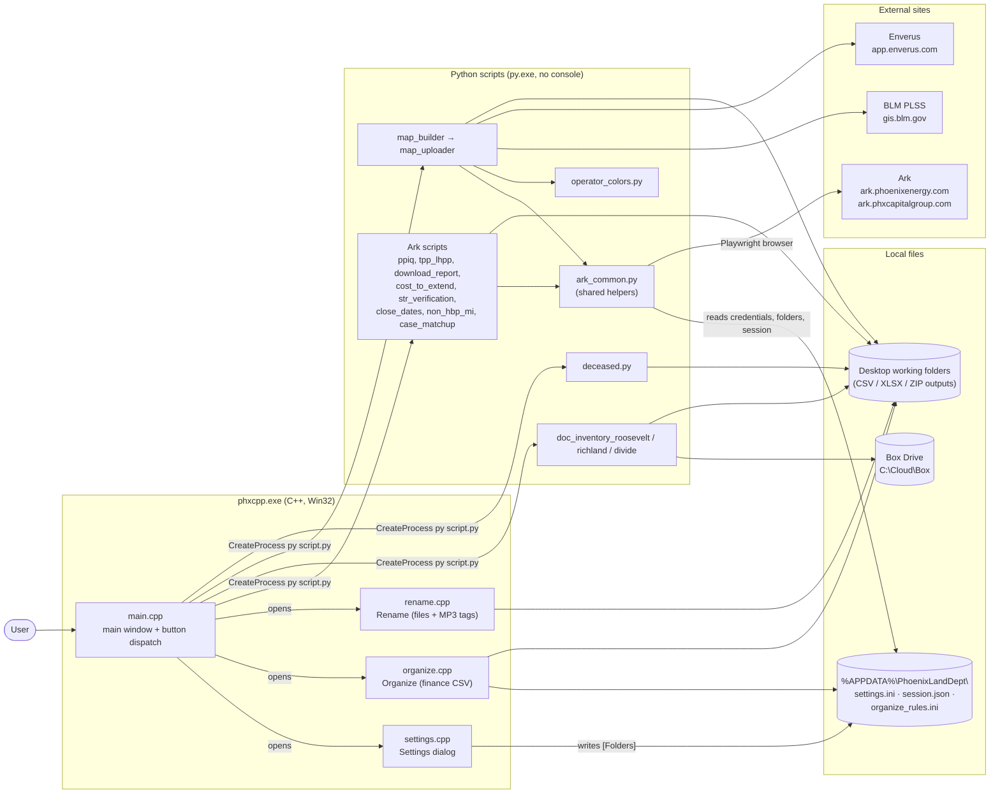
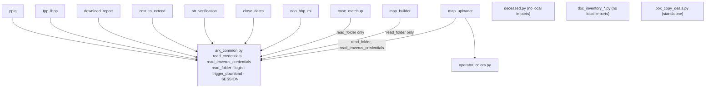
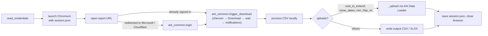
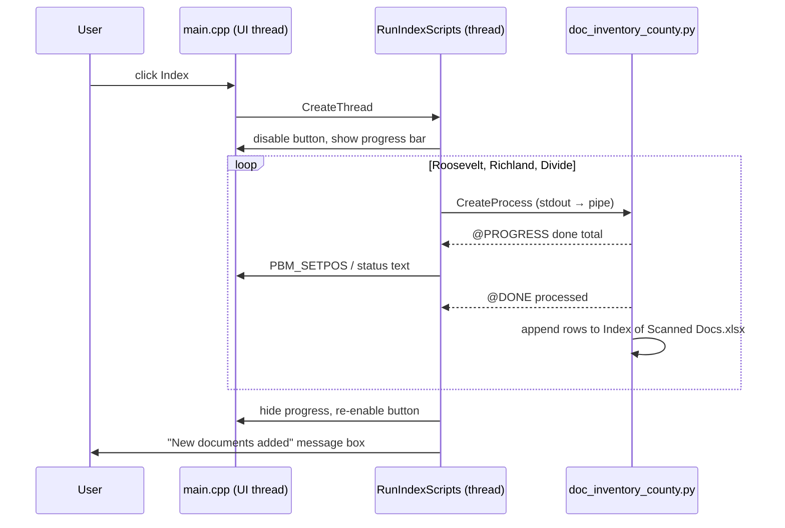
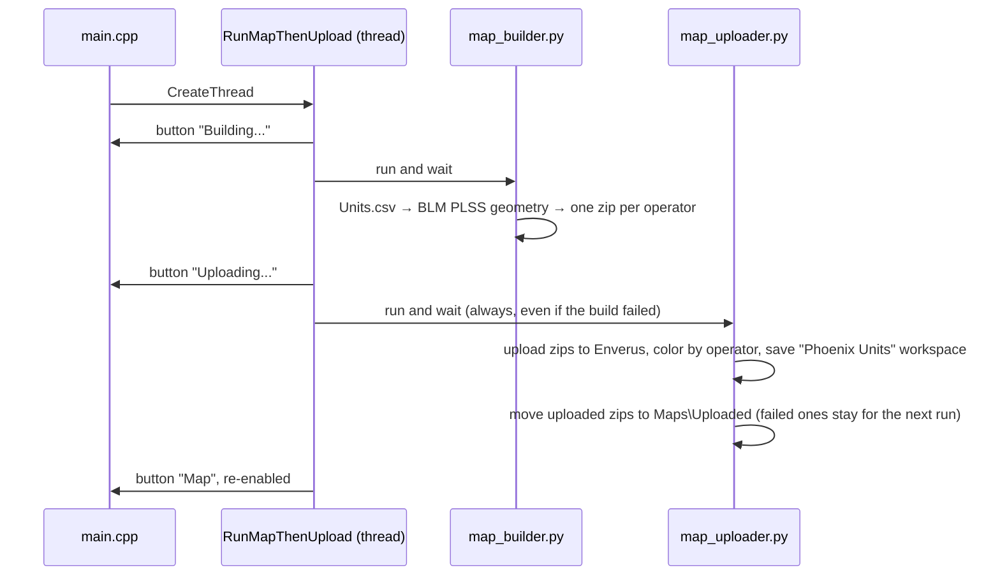
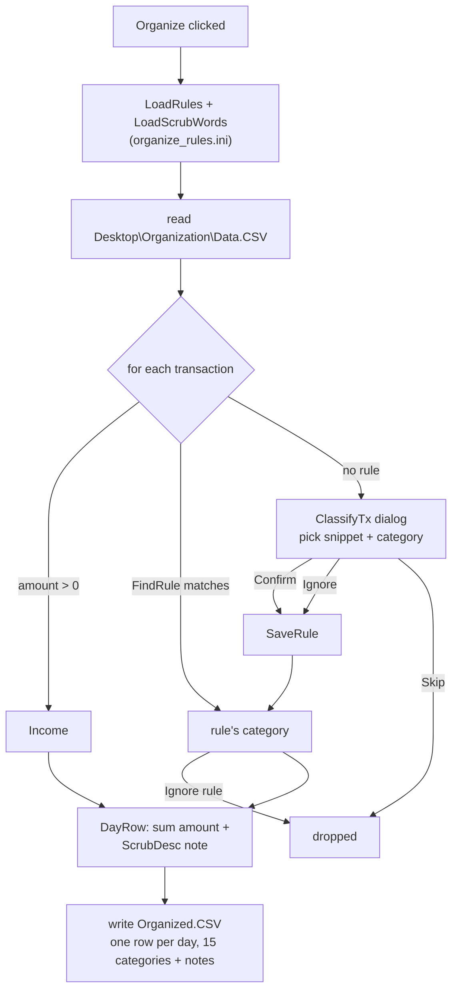
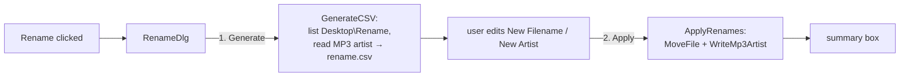

# Architecture — Phoenix Land Department Reporting

`phxcpp.exe` is a small Win32 launcher (C++) with a grid of buttons. Most buttons run a
Python script that sits next to the exe; a few open dialogs written in C++. The scripts
automate Ark (Phoenix's land system), Enverus/drillinginfo and local Box Drive folders.

Companion docs:
- [INDEX.md](INDEX.md) — every function, global and constant, by file
- [KNOWN_ISSUES.md](KNOWN_ISSUES.md) — bugs and risks found while documenting

> Diagrams use [Mermaid](https://mermaid.js.org). They render on GitHub, and in VS Code's
> Markdown preview with the *Markdown Preview Mermaid Support* extension.

---

## 1. System overview

**How a script button works:** `WM_COMMAND` in `main.cpp` finds the exe folder, builds
`py "<exeDir>\script.py"` and calls `CreateProcess` with `CREATE_NO_WINDOW`. It does not
wait (except Index and Map, below). With no console, a script's only visible output is
its own message box. Scripts that don't show one fail silently.

---

## 2. Button map

Layout is set in `LayoutControls` (main.cpp); labels and ids are in the `buttons[]`
table in `WM_CREATE`. **Yellow** = not implemented yet (listed in `g_unwiredButtonIds`).

| Col | Button | Runs | Changes live data? |
|---|---|---|---|
| 1 | PPIQ | `ppiq.py` | No (downloads + local CSV) |
| 1 | Index | `doc_inventory_roosevelt.py` → `_richland.py` → `_divide.py` (background thread, progress bar) | Appends to `Index of Scanned Docs.xlsx` in Box |
| 1 | STR Verification | `str_verification.py` | No |
| 1 | TPP-LHPP | `tpp_lhpp.py` | No |
| 1 | Data Meeting Download | `download_report.py` | No |
| 1 | Cost to Extend | `cost_to_extend.py` | **Yes — Ark Landholdings Update** |
| 1 | Settings *(bottom-left)* | `OpenSettings` (settings.cpp) | settings.ini |
| 2 | ELMI, DNM, HBPNW, LE, LHP, NHBPW, SIB, UNLE, SL | *(yellow — TODO)* | — |
| 3 | Case Matchup | `case_matchup.py` | No |
| 3 | Deceased | `deceased.py` | No (writes upload CSV only) |
| 3 | HBP Wells | *(yellow — TODO)* | — |
| 3 | Organize | `OpenOrganize` (organize.cpp) | No |
| 3 | Rename | `OpenRename` (rename.cpp) | **Renames files / rewrites MP3s** |
| 4 | Close Date | `close_dates.py` | **Yes — Ark Landholdings Update** |
| 4 | Case Update | `non_hbp_mi.py` | **Yes — Ark Units Update** |
| 5 | Map | `map_builder.py` then `map_uploader.py` (background thread) | **Yes — Enverus layers/workspace** |

Not launched by any button: `box_copy_deals.py` (one-off, run by hand).

### Adding a new script button
1. `#define ID_BUTTON_X <unused id>` at the top of main.cpp.
2. Add `{ ID_BUTTON_X, TEXT("Label") }` to `buttons[]` in `WM_CREATE`.
3. Add a `MoveWindow` line for it in `LayoutControls`.
4. Add an `else if (LOWORD(wParam) == ID_BUTTON_X)` branch in `WM_COMMAND` (copy an existing launch branch).
5. Update this table and [INDEX.md](INDEX.md).

---

## 3. Python module dependencies

Third-party libraries: `playwright` (all Ark scripts, map_uploader; imported by ark_common
so every importer needs it), `openpyxl` (tpp_lhpp, doc_inventory), `PyPDF2` (doc_inventory),
`requests`, `pyshp`, `shapely` (map_builder).

### Typical Ark script flow

Used by ppiq, tpp_lhpp, download_report, cost_to_extend, str_verification, close_dates and non_hbp_mi.

---

## 4. Background runs: Index and Map

### Index — stdout protocol

`RunIndexScripts` runs on its own thread. `RunOneIndexScript` pipes each script's stdout
and parses two tags:

| Line | Meaning |
|---|---|
| `@PROGRESS <done> <total>` | moves the progress bar; `total = -1` → marquee (Richland) |
| `@DONE <processed>` | new documents added, shown in the final summary |

A tag can appear anywhere in a line. The scripts print a `\rProcessing: …` line with no newline
just before each tag, so the tag usually lands mid-line.

### Map

---

## 5. C++ dialogs

### Settings (settings.cpp)
A modeless popup; the main window stays disabled until it closes. It has four rows
(Data Meeting Download, STR Verification, Close Dates, Maps). **Change** opens the
`PickFolder` COM folder picker, then `SaveFolders` writes `[Folders]` in settings.ini.
`LoadFolders` runs once at startup.

### Organize (organize.cpp)

### Rename (rename.cpp)

---

## 6. Configuration and shared state

All under `%APPDATA%\PhoenixLandDept\`.

### settings.ini

| Section / key | Written by | Read by |
|---|---|---|
| `[Folders] DataMeetingDownload` | Settings dialog | download_report |
| `[Folders] STRVerification` | Settings dialog | str_verification |
| `[Folders] CloseDates` | Settings dialog | close_dates |
| `[Folders] Maps` | Settings dialog | map_builder, map_uploader |
| `[Folders] CaseMatchup` | *nothing (edit by hand)* | case_matchup |
| `[Folders] NonHBPMI` | *nothing* | non_hbp_mi |
| `[Folders] CostToExtend` | *nothing* | cost_to_extend |
| `[Credentials] username, password` | *by hand* | every Ark script, via `ark_common.read_credentials` |
| `[EnverusCredentials] identifier, password` | *by hand* | map_uploader, via `ark_common.read_enverus_credentials` |

When a `[Folders]` key is missing, each script falls back to a hardcoded Desktop path.

### Other shared files

| File | Owner | Purpose |
|---|---|---|
| `session.json` | Ark scripts, via `ark_common._SESSION` | Playwright login cookies; skips re-login |
| `organize_rules.ini` | organize.cpp | `[Rules]` snippet → category, `[ScrubWords]`, `[Meta] ColumnSchema` |
| `<Maps>\operator_colors.json` | operator_colors.py | stable fill color per operator |

### Hardcoded working folders (no setting)

| Feature | Path |
|---|---|
| PPIQ | `Desktop\PPIQ` |
| TPP-LHPP | `Desktop\TPP-LHPP` |
| Deceased | `Desktop\Bring out your dead` |
| Organize | `Desktop\Organization` (`Data.CSV` → `Organized.CSV`) |
| Rename | `Desktop\Rename` |
| Index | Box `Land\Title Folder\Document Images\...`, `Index of Scanned Docs.xlsx`, output `Desktop\Steph Suko` |

---

## 7. Build

`build_and_run.bat` compiles every `*.cpp` with MSVC (VS at `...\Visual Studio\18\Community`),
embeds the manifest, launches the exe with `explorer` (Device Guard blocks `start`), and
then **runs `git push`**. Python scripts are not compiled; they must sit next to the exe.
